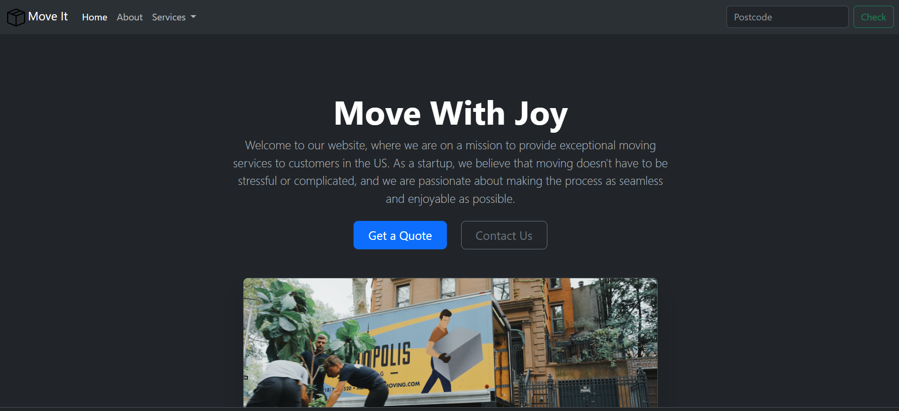
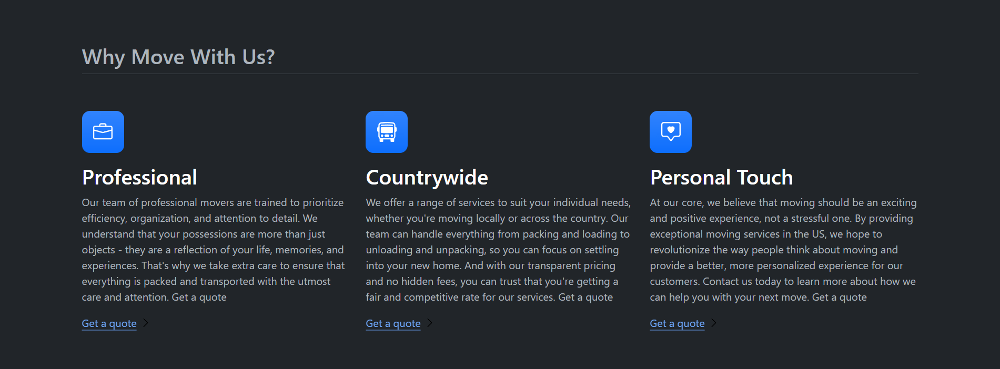

# <div align="center">Move It — Moving Services Landing Page</div>

<div align="center">A clean, fully responsive landing page for a fictional US moving-services startup, built as a single-file website with the Bootstrap 5 framework and a dark theme out of the box.</div>

<br>

> 🌱 **Note:** This is an old beginner project I built purely to learn the fundamentals of **HTML**, **CSS**, and **JavaScript** together with the **Bootstrap** framework. It's a static front-end showcase — no backend, no build step — and it holds a nice place as one of my first hands-on experiments with responsive web design.

## Built with the tools and technologies:

    

## Overview

**Move It** is a marketing landing page for a startup that promises stress-free, countrywide moving services. The entire experience lives in a single `index.html` file that leans on Bootstrap 5's grid, components, and utility classes to stay responsive from mobile to desktop — no custom framework, no dependencies to install, just the CDN and the markup.



## Features

- **Dark Theme by Default** — ships with Bootstrap 5.3's built-in color modes via `data-bs-theme="dark"`, so the whole page renders in a modern dark palette with zero extra CSS.
- **Responsive Navbar** — a collapsible navigation bar with a brand logo, dropdown "Services" menu, and a postcode search form that folds into a hamburger menu on smaller screens.
- **Hero Call-to-Action** — a centered marketing headline with "Get a Quote" and "Contact Us" buttons and a shadowed, rounded hero image.
- **Three-Column Feature Grid** — highlights the "Professional", "Countrywide", and "Personal Touch" value propositions, each with a gradient icon tile and an icon-link call to action.
- **Image Carousel** — a Bootstrap carousel with slide indicators and previous/next controls cycling through lifestyle imagery.
- **Fully Responsive Layout** — Bootstrap's grid (`row-cols-1 row-cols-lg-3`) reflows the columns automatically across breakpoints.



## Tech Stack

- **Markup**: HTML5 (single-page, semantic sections)
- **Styling**: Bootstrap 5.3.0-alpha2 (via CDN) + a small custom `<style>` block for the feature-icon tiles
- **Interactivity**: Bootstrap Bundle JS (dropdowns, collapsible navbar, carousel)
- **Icons**: Bootstrap Icons (bundled locally as `.svg` assets)
- **Theming**: Bootstrap color modes (`data-bs-theme="dark"`)

## Key Snippets

**Enabling Bootstrap's built-in dark theme** — a single attribute on the `<html>` element flips the entire page to dark mode:

```html
<html lang="en" data-bs-theme="dark"></html>
```

**The responsive feature grid** — Bootstrap utility classes make the three columns stack on mobile and spread out on large screens with no media queries of my own:

```html
<div class="row g-4 py-5 row-cols-1 row-cols-lg-3">
  <div class="feature col">
    <div
      class="feature-icon d-inline-flex align-items-center justify-content-center text-bg-primary bg-gradient fs-2 mb-3"
    >
      
    </div>
    <h3 class="fs-2 text-body-emphasis">Professional</h3>
    <p>
      Our team of professional movers are trained to prioritize efficiency,
      organization, and attention to detail...
    </p>
    <a href="#" class="icon-link"
      >Get a quote </a>
  </div>
  <!-- Countrywide + Personal Touch columns -->
</div>
```


## Project Structure

```
bootstrap-Moveit/
├── index.html             # The entire single-page site
├── box-seam.svg           # Navbar brand logo
├── briefcase.svg          # "Professional" feature icon
├── bus-front.svg          # "Countrywide" feature icon
├── chat-square-heart.svg  # "Personal Touch" feature icon
├── chevron-right.svg      # Icon-link arrow
├── moving-van.jpg         # Hero image
├── couple.jpg             # Carousel slide 1
├── dog.jpg                # Carousel slide 2
└── family.jpg             # Carousel slide 3
```

## Running Locally

No build step and no dependencies — just open the file:

```bash
open index.html        # or double-click it in your file explorer
```

Bootstrap's CSS and JS are pulled from the CDN, so an internet connection is all you need for the styling and interactive components to work.

---

<div align="center"><sub>A beginner learning project — built to get comfortable with HTML, CSS, JavaScript, and Bootstrap.</sub></div>
